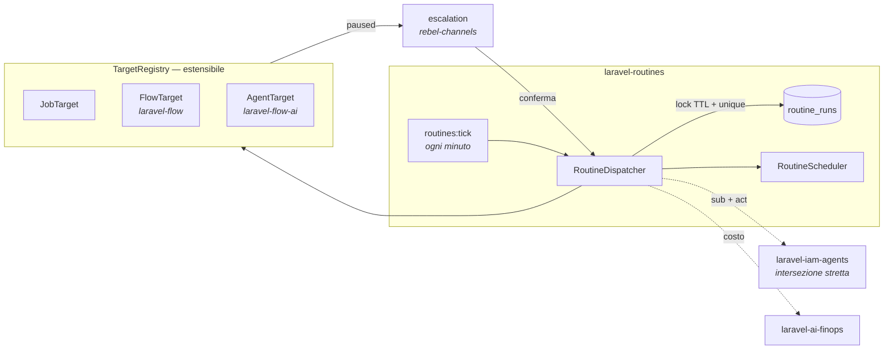

<div align="center">

# laravel-routines

**Automazioni programmate che girano quando non c'è nessuno — e che, quando incontrano qualcosa
che non erano autorizzate a fare, si fermano e chiedono.**

[](https://github.com/padosoft/laravel-routines/actions/workflows/tests.yml)
[](https://packagist.org/packages/padosoft/laravel-routines)
[](LICENSE)
[](composer.json)

</div>

---

## Il problema delle 3 di notte

Una routine è un'automazione che gira **quando l'utente non c'è**. È tutto il suo valore, ed è
anche tutto il suo problema.

Il resto dell'ecosistema Padosoft è costruito su un invariante preciso: **un agente propone,
l'utente conferma a schermo, per singola azione.** È la regola che rende sicura la delega
(`MOBILE-SEC-LLM-001` §6, `laravel-iam-agents`). Ma una routine schedulata alle 3:00 non ha nessuno
a cui chiedere. Le automazioni esistenti risolvono la contraddizione in uno dei due modi peggiori:

| Come lo risolvono gli altri | Cosa significa davvero |
|---|---|
| Gira con le **credenziali dell'applicazione** (service account) | L'automazione può fare *tutto*, per sempre. Nessun utente è responsabile, e l'audit dice "system". |
| Gira con **il token dell'utente**, salvato | L'utente ha consegnato la propria identità a un processo che agirà a tempo indeterminato, senza vederlo. |

Nessuna delle due è una risposta. **Questo pacchetto ne dà una terza.**

### Il mandato permanente, e la pausa

Una routine porta con sé un **mandato**: un consenso permanente ma **più stretto** di quello
interattivo, vincolato a *(bersaglio, classi di azione, tetto di spesa, finestra temporale)* e
legato crittograficamente al digest canonico del payload approvato.

Finché la routine resta dentro il mandato, gira da sola. Quando lo eccede — un ordine da 1.200 €
quando il mandato ne copre 500 — **non fallisce e non procede**: si mette in `paused`, e la
richiesta di approvazione parte verso l'umano su un canale reale (`laravel-rebel-channels`:
Telegram, WhatsApp, SMS, voce). La persona risponde, il fire **riprende da dov'era**, non da capo.

```
mandato ─────────────► gira da sola, nessuno viene disturbato
   │
   └── eccesso ──► paused ──► escalation multicanale ──► conferma ──► resume
                      │
                      └── nessuna risposta ──► resta ferma. Non agisce senza permesso.
```

Che l'ultima riga sia il comportamento di default è il punto: il fallimento sicuro è **fermarsi**,
non "procedere perché tanto era quasi dentro i limiti".

---

## Cosa fa, in breve

- **Trigger**: cron (nel fuso del proprietario), one-shot, manuale, evento applicativo, webhook firmato.
- **Bersagli estensibili**: il core non sa cosa lancia. Un job, un flow, un agente, una query — chi
  conosce il dominio registra un `RoutineTarget` dal proprio provider, e il core non cambia di una riga.
- **Garanzie di esecuzione**: lock con TTL, idempotenza garantita dal database, catch-up delle
  occorrenze perse con tetto, backoff esponenziale, politiche di sovrapposizione.
- **Ora legale gestita davvero** — in entrambe le direzioni, e pinnata da test (vedi sotto).
- **Ledger dei fire**: ogni esecuzione è un fatto immutabile con esito, costo, durata, motivo e
  chiave di idempotenza. È evidenza, non un log.
- **Identità delegata** (fase 2): la routine gira come *l'utente, tramite l'agente* — `sub` +
  `act` — con l'autorità che è l'**intersezione stretta** dei due, valutata a ogni fire.

---

## Installazione

```bash
composer require padosoft/laravel-routines
php artisan vendor:publish --tag=routines-migrations
php artisan migrate
```

Il tick si registra da solo nello scheduler di Laravel (`routines.tick.schedule`). Serve solo che
lo scheduler giri:

```bash
* * * * * cd /path-to-app && php artisan schedule:run >> /dev/null 2>&1
```

---

## Cinque minuti

### 1. Scrivi un bersaglio

```php
use Padosoft\Routines\Contracts\Target\{RoutineTarget, TargetDescriptor, TargetResult, ValidationResult};
use Padosoft\Routines\Contracts\Execution\RoutineExecution;

final class SendDigestTarget implements RoutineTarget
{
    public function type(): string { return 'digest'; }

    public function descriptor(): TargetDescriptor
    {
        return new TargetDescriptor(
            label: 'Digest via email',
            summary: 'Manda il riepilogo del periodo a un indirizzo.',
            fields: ['email' => ['label' => 'Destinatario', 'type' => 'email', 'required' => true]],
            actionClasses: ['email.send'],   // ciò che l'utente autorizza al consenso
            reportsCost: true,
        );
    }

    public function validate(array $payload): ValidationResult
    {
        return filter_var($payload['email'] ?? '', FILTER_VALIDATE_EMAIL)
            ? ValidationResult::valid()
            : ValidationResult::invalid(['email' => ['Indirizzo non valido.']]);
    }

    public function fire(RoutineExecution $execution): TargetResult
    {
        // La chiave di idempotenza arriva dal core ed è STABILE attraverso i retry:
        // è ciò che impedisce alla seconda email di partire dopo un timeout.
        Mail::to($execution->payload('email'))->send(
            new Digest($execution->scheduledFor, $execution->timezone, $execution->idempotencyKey)
        );

        return TargetResult::succeeded('Digest inviato.', cost: 0.001);
    }
}
```

Registralo dal tuo service provider:

```php
$this->app->make(TargetRegistry::class)->register(new SendDigestTarget);
```

### 2. Crea la routine

```php
$routine = app(RoutineManager::class)->create([
    'owner'          => 'user:'.$user->id,
    'name'           => 'Digest del mattino',
    'target_type'    => 'digest',
    'target_payload' => ['email' => $user->email],
    'trigger_kind'   => 'cron',
    'cron'           => '0 6 * * 1-5',
    'timezone'       => 'Europe/Rome',   // le SUE 6:00, non le 6:00 UTC
    'budget_per_run' => 0.50,
    'max_attempts'   => 3,
]);

app(RoutineManager::class)->preview($routine, 5);
// ["2026-09-01 06:00", "2026-09-02 06:00", …] — nel fuso del proprietario
```

Il payload è validato **adesso**, mentre c'è un umano davanti al form. Un payload rotto scoperto al
primo fire delle 3:00 è un fallimento silenzioso dentro un log che nessuno legge.

---

## Gli altri modi di far partire una routine

Il cron è il più comune, non l'unico. Ognuno degli altri porta con sé una domanda che va decisa
una volta e bene: **quando due arrivi sono lo stesso fatto, e quando sono due fatti.**

### Su un evento dell'applicazione

```php
// Dal tuo EventServiceProvider
Event::listen(OrderPlaced::class, function (OrderPlaced $event): void {
    app(EventTrigger::class)->handle('order.placed', $event);
});
```

Ogni emissione riceve una chiave nuova, di default. **Deduplicare due `OrderPlaced` sarebbe peggio
che eseguirli due volte**: significherebbe non spedire un ordine. Se il tuo evento *può* arrivare
due volte per lo stesso fatto — una consegna at-least-once da una coda — esponi
`idempotencyKey(): string` sull'evento e la deduplicazione avviene. È il mittente a saperlo: qui
non c'è modo di indovinarlo.

Dall'oggetto evento passa **solo ciò che è scalare**. L'input finisce nel ledger, e un model intero
ci porterebbe relazioni e talvolta dati che non devono uscire. Serve di più? Esponi
`toRoutineInput(): array` e decidi tu cosa esce.

### Da un webhook firmato

```php
$secret = app(RoutineManager::class)->rotateWebhookSecret($routine);
// Restituito in chiaro UNA VOLTA: da qui in poi esiste solo cifrato in colonna.
```

Il mittente firma con HMAC-SHA256 e chiama `POST /hooks/routines/{id}`:

```
X-Routines-Timestamp: 1788000000
X-Routines-Signature: <hmac_sha256("{timestamp}.{corpo grezzo}", secret)>
X-Routines-Delivery:  <id di consegna>       ← diventa la chiave di idempotenza
```

La rotta sta **fuori dal guard di sessione**: la chiama una macchina, che non ha cookie né CSRF e
non deve averne. La firma è l'unica autenticazione, quindi ogni dettaglio della verifica è una
difesa il cui fallimento sarebbe silenzioso:

| Scelta | Cosa impedisce |
|---|---|
| Si firma il corpo **grezzo**, non il JSON riserializzato | Un `+` normalizzato farebbe fallire ogni consegna legittima — o passarne una che non doveva |
| `hash_equals`, mai `===` | Un confronto che esce al primo byte diverso racconta, nei tempi, quanti byte erano giusti |
| Finestra di 5 minuti sul timestamp **firmato** | Una consegna intercettata resterebbe valida per sempre, rigiocabile fra un anno |
| L'id di consegna è la chiave | Le consegne webhook sono at-least-once **per costruzione**: il mittente garantisce "almeno una", mai "esattamente una" |
| Routine inesistente e routine senza segreto → **stessa risposta** | Distinguerle direbbe a chi prova gli id quali esistono |

Una routine in pausa risponde invece `409`, non `403`: la firma era giusta, e chi chiama deve poter
distinguere «non sei autorizzato» da «è ferma».

Il segreto è **cifrato** a riposo, non hashato — per verificare un HMAC serve il segreto vero al
momento del confronto, quindi il massimo ottenibile è che un dump del database non lo consegni.

---

## Tetti di spesa

Gli scope limitano **cosa** una routine può fare; il tetto limita **quanto**. È la seconda difesa,
ed è quella che manca ovunque: una routine perfettamente autorizzata a "mandare email", chiamata
mille volte da un ciclo impazzito, non ha violato nessun permesso — ha solo mandato mille email.

```php
'budget_per_run'    => 0.50,
'budget_per_period' => 20.00,
'budget_period'     => 'month',   // day | week | month
```

Il tetto si controlla **prima e dopo** ogni fire: solo a monte non basta (il primo sforamento
arriva da un fire che a monte era ancora dentro), solo a valle scopre lo sforamento quando i soldi
sono già spesi. A tetto esaurito la routine si **sospende**, non salta: saltare vorrebbe dire
ritrovare lo stesso tetto superato ogni ora per tutto il resto del mese.

Il periodo si calcola **nel fuso del proprietario** — "questo mese" per chi vive a Roma comincia
due ore prima che a Greenwich — e il messaggio dice **quando riparte**, perché senza, l'unica
azione che resta a chi legge è alzare il tetto, che spesso non è la cosa giusta da fare.

---

## Le decisioni che contano

Un pacchetto di scheduling si giudica su cinque casi limite. Sono tutti pinnati da test.

### Un tick saltato non perde un'esecuzione

Il dispatcher chiede *«cosa è scaduto»* (`next_run_at <= now`), **mai** *«quale cron corrisponde a
questo minuto»*. Un deploy di sei minuti non fa sparire l'occorrenza delle 6:03: la trova al tick
successivo. Chi calcola dal tick perde esecuzioni in silenzio — il modo peggiore di perderle.

### Due worker producono un fire, non due

Il lock è una `UPDATE` condizionale — l'arbitro è il database, non un `if`. E l'unique su
`(routine_id, idempotency_key, attempt)` chiude anche la race che il lock non ha visto: il secondo
inserimento fallisce e quel tick si ritira in silenzio. **È una garanzia di schema, non di codice.**

Il lock ha un TTL, e serve al caso che nessuno considera: il worker che **muore col lock in mano**.
Senza TTL quella routine resta ferma per sempre, e non c'è nessun errore da nessuna parte.

### L'ora legale ha due trappole, e sono diverse fra loro

Quasi tutti gli scheduler ne gestiscono una e ignorano l'altra.

| | Cosa succede | Comportamento |
|---|---|---|
| **Primavera** (29 mar 2026, Roma) | Le 02:30 locali **non esistono** | Il fire scivola alle 03:30 dello stesso giorno. Non si perde. |
| **Autunno** (25 ott 2026, Roma) | Le 02:30 locali esistono **due volte**, in due istanti UTC distinti | Si ricorda l'ultima occorrenza *locale* eseguita e salta la ripetuta. **Un fire, non due.** |

Succede due volte l'anno e nessuno se lo ricorda: per questo entrambi i casi sono pinnati da test
che falliscono se la guardia viene tolta.

### Un downtime non diventa uno sciame

Una routine ogni 5 minuti ferma per un giorno ha 288 occorrenze arretrate, e recuperarle tutte
significa mandare 288 email in trenta secondi. Il recupero ha un tetto (`catch_up_cap`), e la
politica è un **campo esplicito** perché è una scelta di dominio: un report giornaliero va
recuperato, un promemoria delle 9:00 consegnato alle 14:00 è solo rumore (`skip_to_next`).

### `Paused` non è né successo né fallimento

`TargetOutcome` ha quattro casi e non tre. Senza il quarto, chi implementa un bersaglio è costretto
a scegliere fra **procedere senza permesso** e **fallire in silenzio**. Nessuna delle due è ciò che
deve succedere quando l'automazione incontra qualcosa che il mandato non copre.

---

## Confronto

| | **laravel-routines** | Laravel Scheduler | Cron / Supervisor | n8n · Zapier · Make | Trigger.dev · Inngest | Temporal | ChatGPT Tasks · Claude Routines |
|---|:--:|:--:|:--:|:--:|:--:|:--:|:--:|
| Routine create **a runtime** dagli utenti | ✅ | ❌ *(codice)* | ❌ | ✅ | ✅ | ⚠️ | ✅ |
| Fuso del **proprietario**, non del server | ✅ | ⚠️ | ❌ | ⚠️ | ⚠️ | ⚠️ | ✅ |
| Ora legale: **entrambe** le direzioni pinnate | ✅ | ❌ | ❌ | ⚠️ | ⚠️ | ⚠️ | ❓ |
| Recupero occorrenze perse **con tetto** | ✅ | ❌ | ❌ | ⚠️ | ✅ | ✅ | ❌ |
| Idempotenza garantita dallo **schema** | ✅ | ❌ | ❌ | ❌ | ✅ | ✅ | ❌ |
| **Identità delegata** (`sub` + `act`, intersezione stretta) | ✅ | ❌ | ❌ | ❌ | ❌ | ❌ | ❌ |
| **Mandato permanente** più stretto del consenso interattivo | ✅ | ❌ | ❌ | ❌ | ❌ | ❌ | ❌ |
| **Pausa + escalation multicanale** a un umano | ✅ | ❌ | ❌ | ⚠️ *(approval step)* | ❌ | ⚠️ *(signal)* | ❌ |
| **Tetto di spesa** per fire e per periodo | ✅ | ❌ | ❌ | ⚠️ *(quota task)* | ⚠️ | ❌ | ❌ |
| Audit **tamper-evident** hash-chained | ✅ | ❌ | ❌ | ❌ | ❌ | ❌ | ❌ |
| Registro **art. 14 EU AI Act** | ✅ | ❌ | ❌ | ❌ | ❌ | ❌ | ❌ |
| **Domande senza risposta** rilevate come anomalia | ✅ | ❌ | ❌ | ❌ | ❌ | ❌ | ❌ |
| Contratto del bersaglio **spedito come test** | ✅ | ❌ | ❌ | ❌ | ❌ | ⚠️ *(SDK test env)* | ❌ |
| **Self-hosted / sovrano**, nessun per-task pricing | ✅ | ✅ | ✅ | ⚠️ | ❌ | ✅ | ❌ |

Le prime cinque righe sono igiene di scheduling: chi le sbaglia perde o duplica esecuzioni. **Le
righe centrali non le ha nessun altro**, e non per svista: richiedono un IAM con delega
(`laravel-iam-agents`), uno step-up con dynamic linking (`laravel-rebel-step-up`), un livello di
canali (`laravel-rebel-channels`) e un ledger FinOps (`laravel-ai-finops`) — cioè un ecosistema, non
una feature.

Due meritano una riga a parte, perché descrivono guasti che gli altri sistemi **non possono
nemmeno vedere**:

- **Domande senza risposta.** Una routine che si è fermata a chiedere e che nessuno ha risposto è il
  guasto peggiore del sistema, ed è invisibile per costruzione: la routine sta facendo esattamente
  ciò che deve — non agisce senza permesso — quindi non produce nessun errore, in nessun log, per
  nessun monitoraggio. `laravel-rebel-ai-guard` la rileva come `routine_approval_starvation`, con la
  domanda più vecchia in chiaro nel caso, e può sospendere la routine perché smetta di accumularne
  altre.
- **Il contratto del bersaglio spedito come test.** Il bersaglio lo scrive chi installa, e nessuna
  garanzia del motore lo copre. `Testing\TargetContract` rende eseguibili le quattro regole che lo
  rendono sicuro (vedi [Test](#test)).

> **Onestà sullo stato.** Tutto quanto sopra è implementato e coperto da test, con una precisazione:
> l'**identità delegata** e l'**escalation multicanale** sono *seam* — il pacchetto definisce i
> contratti (`RoutineDelegationBroker`, `RoutineEscalator`), li chiama nei punti giusti e ha i
> default che falliscono in modo sicuro; le implementazioni concrete arrivano da
> `laravel-iam-agents` e `laravel-rebel-channels`. Senza quei pacchetti la routine gira come
> l'applicazione e la domanda finisce nel log a livello `warning` invece che su Telegram.

---

## Architettura



**Tre pacchetti, un confine netto:**

| | |
|---|---|
| `padosoft/laravel-routines-contracts` | Zero dipendenze. `RoutineTarget`, `RoutineExecution`, `TargetOutcome`, `RoutineMandate`. Chi scrive un bersaglio dipende **solo** da qui. |
| `padosoft/laravel-routines` | Il motore: schedulazione, dispatch, ledger, registro. |
| `padosoft/laravel-routines-admin` | Il pannello (React + Vite + Tailwind), interamente su API. |

---

## Configurazione

```php
// config/routines.php
'lock_seconds'       => 900,   // più lungo del fire più lento che ti aspetti
'catch_up_cap'       => 25,    // un downtime non deve diventare uno sciame
'retry_base_seconds' => 60,    // backoff esponenziale: 1', 2', 4', 8'…

'targets' => [
    'job' => [
        'enabled' => true,
        // Vuoto per default, ed è deliberato.
        'allowed' => [App\Jobs\SendDailyDigest::class],
    ],
],
```

### Perché l'allow-list dei job non è una precauzione

Il payload di una routine è **dato**: arriva da un form, può arrivare da un import, e in fase 3 può
arrivare da un assistente che l'ha proposta. Istanziare la classe che ci si trova dentro
significherebbe dare a quel dato il diritto di eseguire **qualsiasi cosa esista
nell'applicazione**. Per questo i job schedulabili si dichiarano, e l'allow-list si ricontrolla
**anche al fire**: una routine creata quando un job era permesso non deve continuare a girare dopo
che è stato tolto.

---

## Comandi

```bash
php artisan routines:tick --limit=100   # un giro (di norma lo chiama lo scheduler)
php artisan routines:list --status=active
```

---

## Eventi

| Evento | Quando |
|---|---|
| `RoutineFired` | Prima del lavoro — chi ascolta può ancora fermarlo lanciando |
| `RoutineFinished` | Esito noto, **qualunque** esso sia (uno solo, così nessuno se ne dimentica uno) |
| `RoutinePaused` | Serve un umano. È qui che si aggancia l'escalation |
| `RoutineSuspended` | Il sistema l'ha fermata: bersaglio sparito, budget esaurito, anomalia |
| `RoutineResolved` | Un umano ha risposto. Emesso **prima** che il lavoro riprenda: chi registra la decisione non deve aspettarne l'esito |
| `RoutineMandateGranted` | Concesso il consenso permanente, con la sua evidenza (confirmation id, AAL) |

---

## Integrazione con l'ecosistema

| Pacchetto | Cosa aggiunge |
|---|---|
| [`laravel-iam-agents`](https://github.com/padosoft/laravel-iam-agents) | La routine gira come *utente tramite agente*; autorità = intersezione stretta, rivalutata a ogni fire |
| [`laravel-rebel-step-up`](https://github.com/padosoft/laravel-rebel-step-up) | Consenso al mandato ad AAL2 con dynamic linking: cambiare il payload invalida la conferma |
| [`laravel-rebel-channels`](https://github.com/padosoft/laravel-rebel-channels) | L'escalation su Telegram / WhatsApp / SMS / voce quando una routine si ferma |
| [`laravel-ai-finops`](https://github.com/padosoft/laravel-ai-finops) | Tetti di spesa per fire e per periodo, con sospensione automatica |
| [`laravel-flow`](https://github.com/padosoft/laravel-flow) · [`laravel-flow-ai`](https://github.com/padosoft/laravel-flow-ai) | `FlowTarget` e `AgentTarget`: una routine lancia un grafo o un agente |
| [`laravel-ai-act-compliance`](https://github.com/padosoft/laravel-ai-act-compliance) | Il mandato come record di sorveglianza art. 14 (col digest del payload), la routine nel registro rischi art. 6, ogni pausa tracciata fino alla risposta |
| [`laravel-rebel-ai-guard`](https://github.com/padosoft/laravel-rebel-ai-guard) | Anomalie sul ledger dei fire: raffica, fallimenti a ripetizione, mandato sondato, e **domande senza risposta** — con sospensione automatica opzionale |

Nessuna è obbligatoria: senza nulla installato, il pacchetto è uno scheduler che non perde e non
duplica esecuzioni.

---

## Test

```bash
composer test
```

I test non coprono il percorso felice — coprono i casi che rompono gli scheduler veri: due worker
concorrenti, un lock di un worker morto, entrambe le direzioni dell'ora legale, un downtime di sei
ore, un bersaglio disinstallato, un'eccezione non prevista, un webhook consegnato due volte.

### Il contratto del tuo bersaglio, in forma eseguibile

I test qui sopra provano che il **motore** mantiene le sue garanzie. Il bersaglio lo scrivi tu, e
le regole che lo rendono sicuro vivrebbero altrimenti solo nella prosa di questo README. Il
pacchetto ne spedisce la versione eseguibile:

```php
use Padosoft\Routines\Testing\TargetContract;

final class InvoiceReminderTargetTest extends TestCase
{
    public function test_it_respects_the_routine_target_contract(): void
    {
        TargetContract::assertAll(
            new InvoiceReminderTarget(...),
            validPayload: ['template' => 'reminder'],
            invalidPayload: ['template' => ''],
            // Il caso «fuori dal mandato» si esprime come input del fire oppure come
            // configurazione, perche' i bersagli reali decidono in entrambi i modi:
            outOfMandatePayload: ['template' => 'reminder', 'write_off_days' => 365],
        );
    }
}
```

Quattro asserzioni, e ciascuna corrisponde a un modo di fallire **in silenzio**:

| Asserzione | Il guasto che previene |
|---|---|
| Il payload viene validato, con l'errore sul campo | Un payload rotto scoperto alle 3:00 in un log che nessuno legge, invece che nel form |
| Il descrittore dichiara le classi di azione | Nessun mandato può autorizzarlo, e nessuna pausa può dire a un umano **che cosa** sta approvando |
| Riesecuzione alla stessa chiave di idempotenza → stesso esito | Un timeout di rete diventa una seconda email davvero mandata |
| Fuori dal mandato ci si **ferma** (`paused` o `MandateExceeded`), non si fallisce | Fallire fa arrendere la routine in silenzio; riuscire significa aver agito senza permesso |

Ogni asserzione del kit ha, nella suite del pacchetto, un test che la vede **fallire** sul
bersaglio che la viola: un kit che passa su qualsiasi cosa non prova niente.

---

## Licenza

MIT © [Padosoft](https://padosoft.com)
