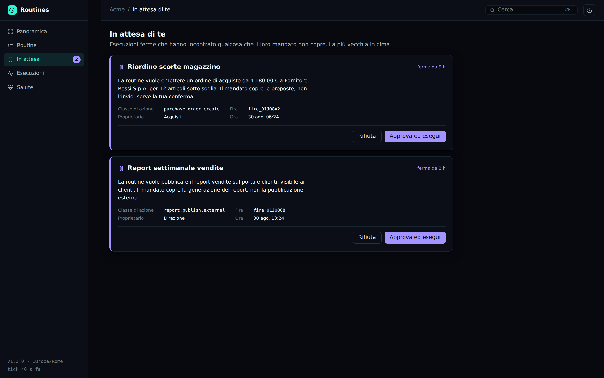

<div align="center">

# laravel-routines

**Scheduled automations that run when nobody is there — and that stop and ask when they hit
something they were not authorized to do.**

[](https://github.com/padosoft/laravel-routines/actions/workflows/tests.yml)
[](https://packagist.org/packages/padosoft/laravel-routines)
[](LICENSE)
[](composer.json)

</div>


<div align="center"><sub>

The panel is the companion package **[`padosoft/laravel-routines-admin`](https://github.com/padosoft/laravel-routines-admin)** — React + Vite + Tailwind, built entirely on this package's Admin API.

</sub></div>

---

## The 3am problem

A routine is an automation that runs **when the user is not there**. That is its entire value, and
its entire problem.

The rest of the Padosoft ecosystem rests on one invariant: **an agent proposes, the user confirms
on screen, per action.** It is the rule that makes delegation safe (`MOBILE-SEC-LLM-001` §6,
`laravel-iam-agents`). But a routine scheduled for 3am has nobody to ask. Existing automation
resolves the contradiction in one of the two worst ways:

| How everyone else resolves it | What it actually means |
|---|---|
| Runs with **application credentials** (service account) | The automation can do *everything*, forever. No user is accountable, and the audit says "system". |
| Runs with **the user's stored token** | The user handed their identity to a process that will act indefinitely, unwatched. |

Neither is an answer. **This package gives a third one.**

### The standing mandate, and the pause

A routine carries a **mandate**: a consent that is standing but **narrower** than the interactive
one, bound to *(target, action classes, spend ceiling, time window)* and tied cryptographically to
the canonical digest of the approved payload.

While the routine stays inside its mandate, it runs alone. When it exceeds it — a €1,200 order when
the mandate covers 500 — it **neither fails nor proceeds**: it goes `paused`, and the approval
request goes out to a human on a real channel (`laravel-rebel-channels`: Telegram, WhatsApp, SMS,
voice). The person answers, and the fire **resumes where it stopped**, not from the beginning.

```
mandate ─────────────► runs alone, nobody is disturbed
   │
   └── exceeded ──► paused ──► multi-channel escalation ──► confirm ──► resume
                      │
                      └── no answer ──► it stays put. It does not act without permission.
```

That the last line is the default behaviour is the whole point: the safe failure is **stopping**,
not "going ahead because it was almost within the limits anyway".

---

## What it does, briefly

- **Triggers**: cron (in the owner's timezone), one-shot, manual, application event, signed webhook.
- **Extensible targets**: the core does not know what it launches. A job, a flow, an agent, a query
  — whoever owns the domain registers a `RoutineTarget` from their own provider, and the core does
  not change by a line.
- **Execution guarantees**: locks with a TTL, idempotency enforced by the database, capped catch-up
  of missed occurrences, exponential backoff, overlap policies.
- **Daylight saving handled for real** — in both directions, and pinned by tests (see below).
- **Fire ledger**: every execution is an immutable fact with outcome, cost, duration, reason and
  idempotency key. It is evidence, not a log.
- **Delegated identity** (phase 2): the routine runs as *the user, through the agent* — `sub` +
  `act` — with authority that is the **strict intersection** of the two, re-evaluated on every fire.

---

## Installation

```bash
composer require padosoft/laravel-routines
php artisan vendor:publish --tag=routines-migrations
php artisan migrate
```

The tick registers itself with Laravel's scheduler (`routines.tick.schedule`). All you need is the
scheduler running:

```bash
* * * * * cd /path-to-app && php artisan schedule:run >> /dev/null 2>&1
```

---

## Five minutes

### 1. Write a target

```php
use Padosoft\Routines\Contracts\Target\{RoutineTarget, TargetDescriptor, TargetResult, ValidationResult};
use Padosoft\Routines\Contracts\Execution\RoutineExecution;

final class SendDigestTarget implements RoutineTarget
{
    public function type(): string { return 'digest'; }

    public function descriptor(): TargetDescriptor
    {
        return new TargetDescriptor(
            label: 'Digest by email',
            summary: 'Sends the period summary to an address.',
            fields: ['email' => ['label' => 'Recipient', 'type' => 'email', 'required' => true]],
            actionClasses: ['email.send'],   // what the user authorizes at consent time
            reportsCost: true,
        );
    }

    public function validate(array $payload): ValidationResult
    {
        return filter_var($payload['email'] ?? '', FILTER_VALIDATE_EMAIL)
            ? ValidationResult::valid()
            : ValidationResult::invalid(['email' => ['Not a valid address.']]);
    }

    public function fire(RoutineExecution $execution): TargetResult
    {
        // The idempotency key comes from the core and is STABLE across retries:
        // it is what stops the second email from going out after a timeout.
        Mail::to($execution->payload('email'))->send(
            new Digest($execution->scheduledFor, $execution->timezone, $execution->idempotencyKey)
        );

        return TargetResult::succeeded('Digest sent.', cost: 0.001);
    }
}
```

Register it from your service provider:

```php
$this->app->make(TargetRegistry::class)->register(new SendDigestTarget);
```

### 2. Create the routine

```php
$routine = app(RoutineManager::class)->create([
    'owner'          => 'user:'.$user->id,
    'name'           => 'Morning digest',
    'target_type'    => 'digest',
    'target_payload' => ['email' => $user->email],
    'trigger_kind'   => 'cron',
    'cron'           => '0 6 * * 1-5',
    'timezone'       => 'Europe/Rome',   // THEIR 6am, not 6am UTC
    'budget_per_run' => 0.50,
    'max_attempts'   => 3,
]);

app(RoutineManager::class)->preview($routine, 5);
// ["2026-09-01 06:00", "2026-09-02 06:00", …] — in the owner's timezone
```

The payload is validated **now**, while there is a human in front of the form. A broken payload
discovered on the first 3am fire is a silent failure inside a log nobody reads.

---

## The other ways to fire a routine

Cron is the most common one, not the only one. Each of the others carries a question that has to be
decided once, and well: **when are two arrivals the same fact, and when are they two facts.**

### On an application event

```php
// From your EventServiceProvider
Event::listen(OrderPlaced::class, function (OrderPlaced $event): void {
    app(EventTrigger::class)->handle('order.placed', $event);
});
```

Every emission gets a fresh key by default. **Deduplicating two `OrderPlaced` would be worse than
running them twice**: it would mean not shipping an order. If your event *can* arrive twice for the
same fact — an at-least-once delivery from a queue — expose `idempotencyKey(): string` on the event
and deduplication happens. The sender is the one who knows: there is no way to guess it here.

From the event object, only **scalars** are passed through. The input goes into the ledger, and a
whole model would drag relations along with it, and sometimes data that must not leave. Need more?
Expose `toRoutineInput(): array` and decide yourself what goes out.

### From a signed webhook

```php
$secret = app(RoutineManager::class)->rotateWebhookSecret($routine);
// Returned in clear ONCE: from here on it only exists encrypted in its column.
```

The sender signs with HMAC-SHA256 and calls `POST /hooks/routines/{id}`:

```
X-Routines-Timestamp: 1788000000
X-Routines-Signature: <hmac_sha256("{timestamp}.{raw body}", secret)>
X-Routines-Delivery:  <delivery id>       ← becomes the idempotency key
```

The route sits **outside the session guard**: a machine calls it, and a machine has no cookie and no
CSRF token, and must not need one. The signature is the only authentication, so every detail of the
verification is a defence whose failure would be silent:

| Choice | What it prevents |
|---|---|
| The **raw** body is signed, not the re-serialised JSON | A normalised `+` would fail every legitimate delivery — or let through one that should not have been |
| `hash_equals`, never `===` | A comparison that returns on the first differing byte tells you, in its timing, how many bytes were right |
| A 5-minute window on the **signed** timestamp | An intercepted delivery would stay valid forever, replayable a year from now |
| The delivery id is the key | Webhook deliveries are at-least-once **by construction**: the sender guarantees "at least one", never "exactly one" |
| Unknown routine and routine without a secret → **the same response** | Telling them apart would tell anyone probing ids which ones exist |

A paused routine answers `409` instead, not `403`: the signature was right, and the caller must be
able to tell "you are not authorized" from "it is stopped".

The secret is **encrypted** at rest, not hashed — verifying an HMAC needs the real secret at
comparison time, so the most that can be achieved is that a database dump does not hand it over.

---

## Spend ceilings

Scopes limit **what** a routine may do; the ceiling limits **how much**. It is the second defence,
and it is the one missing everywhere: a routine perfectly authorized to "send email", called a
thousand times by a runaway loop, has violated no permission — it has just sent a thousand emails.

```php
'budget_per_run'    => 0.50,
'budget_per_period' => 20.00,
'budget_period'     => 'month',   // day | week | month
```

The ceiling is checked **before and after** every fire: before alone is not enough (the first
overrun comes from a fire that was still inside beforehand), after alone discovers the overrun once
the money is already spent. On an exhausted ceiling the routine **suspends** rather than skipping:
skipping would mean meeting the same exceeded ceiling every hour for the rest of the month.

The period is computed **in the owner's timezone** — "this month" for someone living in Rome starts
two hours before it does in Greenwich — and the message says **when it resumes**, because without
that the only action left to the reader is to raise the ceiling, which is often not the right thing
to do.

---

## The decisions that matter

A scheduling package is judged on five edge cases. All five are pinned by tests.

### A missed tick does not lose an execution

The dispatcher asks *"what is due"* (`next_run_at <= now`), **never** *"which cron matches this
minute"*. A six-minute deploy does not make the 6:03 occurrence disappear: it is found on the next
tick. Anything that computes from the tick loses executions silently — the worst way to lose them.

### Two workers produce one fire, not two

The lock is a conditional `UPDATE` — the arbiter is the database, not an `if`. And the unique on
`(routine_id, idempotency_key, attempt)` also closes the race the lock did not see: the second
insert fails and that tick withdraws quietly. **It is a schema guarantee, not a code one.**

The lock has a TTL, and it exists for the case nobody considers: the worker that **dies holding the
lock**. Without a TTL that routine stays stopped forever, and there is no error anywhere.

### Daylight saving has two traps, and they are different from each other

Almost every scheduler handles one and ignores the other.

| | What happens | Behaviour |
|---|---|---|
| **Spring** (29 Mar 2026, Rome) | 02:30 local **does not exist** | The fire slides to 03:30 the same day. It is not lost. |
| **Autumn** (25 Oct 2026, Rome) | 02:30 local exists **twice**, at two distinct UTC instants | The last executed *local* occurrence is remembered and the repeat is skipped. **One fire, not two.** |

It happens twice a year and nobody remembers it: which is why both cases are pinned by tests that
fail if the guard is removed.

### A downtime does not become a swarm

A routine running every 5 minutes, stopped for a day, has 288 occurrences behind it, and catching up
on all of them means sending 288 emails in thirty seconds. Catch-up has a cap (`catch_up_cap`), and
the policy is an **explicit field** because it is a domain decision: a daily report is worth
catching up on, a 9am reminder delivered at 2pm is just noise (`skip_to_next`).

### `Paused` is neither success nor failure

`TargetOutcome` has four cases and not three. Without the fourth, whoever implements a target is
forced to choose between **proceeding without permission** and **failing silently**. Neither is what
should happen when an automation meets something its mandate does not cover.

---

## Comparison

| | **laravel-routines** | Laravel Scheduler | Cron / Supervisor | n8n · Zapier · Make | Trigger.dev · Inngest | Temporal | ChatGPT Tasks · Claude Routines |
|---|:--:|:--:|:--:|:--:|:--:|:--:|:--:|
| Routines created **at runtime** by users | ✅ | ❌ *(code)* | ❌ | ✅ | ✅ | ⚠️ | ✅ |
| The **owner's** timezone, not the server's | ✅ | ⚠️ | ❌ | ⚠️ | ⚠️ | ⚠️ | ✅ |
| DST: **both** directions pinned | ✅ | ❌ | ❌ | ⚠️ | ⚠️ | ⚠️ | ❓ |
| Catch-up of missed occurrences **with a cap** | ✅ | ❌ | ❌ | ⚠️ | ✅ | ✅ | ❌ |
| Idempotency enforced by the **schema** | ✅ | ❌ | ❌ | ❌ | ✅ | ✅ | ❌ |
| **Delegated identity** (`sub` + `act`, strict intersection) | ✅ | ❌ | ❌ | ❌ | ❌ | ❌ | ❌ |
| **Standing mandate** narrower than interactive consent | ✅ | ❌ | ❌ | ❌ | ❌ | ❌ | ❌ |
| **Pause + multi-channel escalation** to a human | ✅ | ❌ | ❌ | ⚠️ *(approval step)* | ❌ | ⚠️ *(signal)* | ❌ |
| **Spend ceiling** per fire and per period | ✅ | ❌ | ❌ | ⚠️ *(task quota)* | ⚠️ | ❌ | ❌ |
| **Tamper-evident** hash-chained audit | ✅ | ❌ | ❌ | ❌ | ❌ | ❌ | ❌ |
| **EU AI Act art. 14** register | ✅ | ❌ | ❌ | ❌ | ❌ | ❌ | ❌ |
| **Unanswered questions** detected as an anomaly | ✅ | ❌ | ❌ | ❌ | ❌ | ❌ | ❌ |
| Target contract **shipped as tests** | ✅ | ❌ | ❌ | ❌ | ❌ | ⚠️ *(SDK test env)* | ❌ |
| **Self-hosted / sovereign**, no per-task pricing | ✅ | ✅ | ✅ | ⚠️ | ❌ | ✅ | ❌ |

The first five rows are scheduling hygiene: get them wrong and you lose or duplicate executions.
**The middle rows nobody else has**, and not by oversight: they require an IAM with delegation
(`laravel-iam-agents`), a step-up with dynamic linking (`laravel-rebel-step-up`), a channel layer
(`laravel-rebel-channels`) and a FinOps ledger (`laravel-ai-finops`) — an ecosystem, that is, not a
feature.

Two deserve a line of their own, because they describe failures the other systems **cannot even
see**:

- **Unanswered questions.** A routine that paused to ask and that nobody answered is the worst
  failure in the system, and it is invisible by construction: the routine is doing exactly what it
  should — it does not act without permission — so it produces no error, in no log, for no monitor.
  `laravel-rebel-ai-guard` detects it as `routine_approval_starvation`, carrying the oldest question
  verbatim in the case, and can suspend the routine so it stops accumulating more.
- **The target contract shipped as tests.** The target is written by whoever installs the package,
  and no engine guarantee covers it. `Testing\TargetContract` makes the four rules that keep it safe
  executable (see [Tests](#tests)).

> **Honesty about status.** Everything above is implemented and covered by tests, with one
> clarification: **delegated identity** and **multi-channel escalation** are *seams* — the package
> defines the contracts (`RoutineDelegationBroker`, `RoutineEscalator`), calls them at the right
> points and ships defaults that fail safe; the concrete implementations come from
> `laravel-iam-agents` and `laravel-rebel-channels`. Without those packages the routine runs as the
> application, and the question lands in the log at `warning` level instead of on Telegram.

---

## Architecture


**Three packages, one clean boundary:**

| | |
|---|---|
| `padosoft/laravel-routines-contracts` | Zero dependencies. `RoutineTarget`, `RoutineExecution`, `TargetOutcome`, `RoutineMandate`. Whoever writes a target depends on **this alone**. |
| `padosoft/laravel-routines` | The engine: scheduling, dispatch, ledger, registry. |
| `padosoft/laravel-routines-admin` | The panel (React + Vite + Tailwind), entirely on the API. |

### The panel

```bash
composer require padosoft/laravel-routines-admin
php artisan vendor:publish --tag=routines-admin-assets
```

[`padosoft/laravel-routines-admin`](https://github.com/padosoft/laravel-routines-admin) is the
reference consumer of the Admin API, **but not a privileged one**: everything it does goes through
the same HTTP endpoints available to anything else. If the panel is replaced tomorrow the API
stays, and with it every integration built on top. It is the same separation `laravel-iam-console`
has from `laravel-iam-server`.

The screen the product is named for is this one: the routines that stopped because they met
something their mandate does not cover. They are not failures — they are doing exactly what they
were written to do — and that is precisely why they **appear in no error log and trip no monitor**.
The only place they show up is a queue somebody looks at.



The panel also adapts to a phone, which is where "a routine is waiting for you" tends to be read —
away from a desk.

---

## Configuration

```php
// config/routines.php
'lock_seconds'       => 900,   // longer than the slowest fire you expect
'catch_up_cap'       => 25,    // a downtime must not become a swarm
'retry_base_seconds' => 60,    // exponential backoff: 1', 2', 4', 8'…

'targets' => [
    'job' => [
        'enabled' => true,
        // Empty by default, and deliberately so.
        'allowed' => [App\Jobs\SendDailyDigest::class],
    ],
],
```

### Why the job allow-list is not a precaution

A routine's payload is **data**: it comes from a form, it can come from an import, and in phase 3 it
can come from an assistant that proposed it. Instantiating whatever class is found inside would give
that data the right to execute **anything that exists in the application**. That is why schedulable
jobs are declared, and why the allow-list is re-checked **at fire time too**: a routine created when
a job was permitted must not keep running after it has been removed.

---

## Commands

```bash
php artisan routines:tick --limit=100   # one pass (normally called by the scheduler)
php artisan routines:list --status=active
```

---

## Events

| Event | When |
|---|---|
| `RoutineFired` | Before the work — a listener can still stop it by throwing |
| `RoutineFinished` | Outcome known, **whatever** it is (one event, so nobody forgets one) |
| `RoutinePaused` | A human is needed. This is where escalation hooks in |
| `RoutineSuspended` | The system stopped it: target gone, budget exhausted, anomaly |
| `RoutineResolved` | A human answered. Dispatched **before** the work resumes: whoever records the decision should not have to wait for its outcome |
| `RoutineMandateGranted` | Standing consent granted, with its evidence (confirmation id, AAL) |

---

## Ecosystem integration

| Package | What it adds |
|---|---|
| [`laravel-iam-agents`](https://github.com/padosoft/laravel-iam-agents) | The routine runs as *user through agent*; authority = strict intersection, re-evaluated on every fire |
| [`laravel-rebel-step-up`](https://github.com/padosoft/laravel-rebel-step-up) | Mandate consent at AAL2 with dynamic linking: changing the payload invalidates the confirmation |
| [`laravel-rebel-channels`](https://github.com/padosoft/laravel-rebel-channels) | The escalation over Telegram / WhatsApp / SMS / voice when a routine stops |
| [`laravel-ai-finops`](https://github.com/padosoft/laravel-ai-finops) | Spend ceilings per fire and per period, with automatic suspension |
| [`laravel-flow`](https://github.com/padosoft/laravel-flow) · [`laravel-flow-ai`](https://github.com/padosoft/laravel-flow-ai) | `FlowTarget` and `AgentTarget`: a routine launches a graph or an agent |
| [`laravel-ai-act-compliance`](https://github.com/padosoft/laravel-ai-act-compliance) | The mandate as an art. 14 oversight record (with the payload digest), the routine in the art. 6 risk register, every pause tracked through to its answer |
| [`laravel-rebel-ai-guard`](https://github.com/padosoft/laravel-rebel-ai-guard) | Anomalies on the fire ledger: bursts, repeated failures, mandate probing, and **unanswered questions** — with optional automatic suspension |

None of them is required: with nothing installed, the package is a scheduler that neither loses nor
duplicates executions.

---

## Tests

```bash
composer test
```

The tests do not cover the happy path — they cover the cases that break real schedulers: two
concurrent workers, a dead worker's lock, both directions of daylight saving, a six-hour downtime,
an uninstalled target, an unexpected exception, a webhook delivered twice.

### Your target's contract, in executable form

The tests above prove the **engine** keeps its guarantees. The target is yours to write, and the
rules that keep it safe would otherwise live only in this README's prose. The package ships the
executable version of them:

```php
use Padosoft\Routines\Testing\TargetContract;

final class InvoiceReminderTargetTest extends TestCase
{
    public function test_it_respects_the_routine_target_contract(): void
    {
        TargetContract::assertAll(
            new InvoiceReminderTarget(...),
            validPayload: ['template' => 'reminder'],
            invalidPayload: ['template' => ''],
            // The "outside the mandate" case is expressed either as fire input or as
            // configuration, because real targets decide in both ways:
            outOfMandatePayload: ['template' => 'reminder', 'write_off_days' => 365],
        );
    }
}
```

Four assertions, and each one matches a way of failing **silently**:

| Assertion | The failure it prevents |
|---|---|
| The payload is validated, with the error on the field | A broken payload discovered at 3am in a log nobody reads, instead of in the form |
| The descriptor declares its action classes | No mandate can authorize it, and no pause can tell a human **what** they are approving |
| Re-running on the same idempotency key → the same outcome | A network timeout becomes a second email actually sent |
| Outside the mandate it **stops** (`paused` or `MandateExceeded`), it does not fail | Failing makes the routine give up quietly; succeeding means it acted without permission |

Every assertion in the kit has, in this package's own suite, a test that watches it **fail** against
a target that violates it: a kit that passes on anything proves nothing.

---

## License

MIT © [Padosoft](https://padosoft.com)
